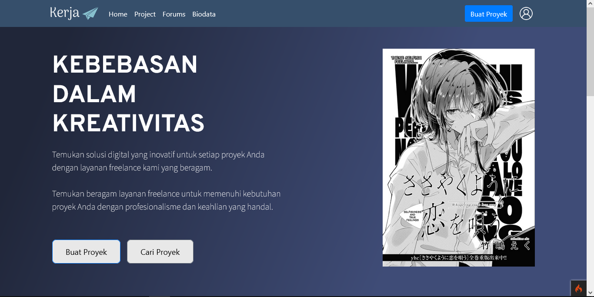
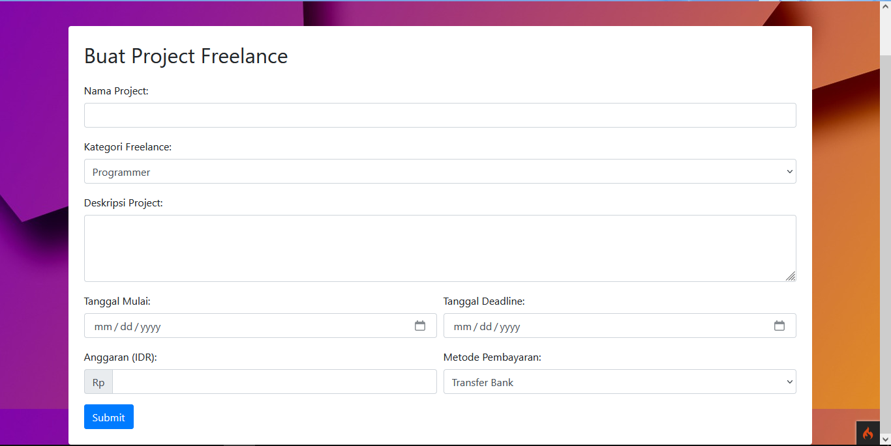
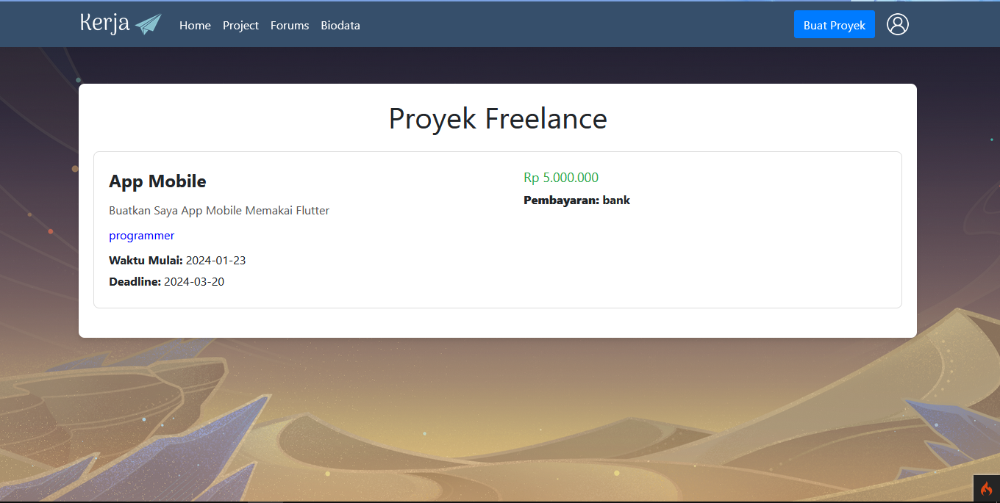
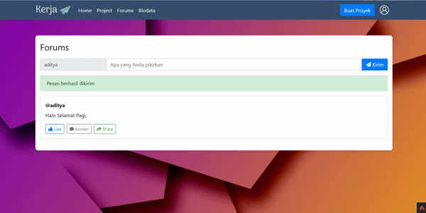

<h1 align="center">Kerja - Platform Freelance untuk IT</h1>

Selamat datang di repositori Kerja! Ini adalah platform freelance yang dirancang khusus untuk para profesional IT dan pengusaha yang mencari layanan IT berkualitas. Dengan Kerja, kami bertujuan mempermudah penghubung antara freelancer IT yang berbakat dan klien yang membutuhkan keahlian khusus.

## Fitur Utama

- <strong>Pencarian Freelancer:</strong> Cari freelancer berdasarkan keahlian, pengalaman, dan lokasi.
- <strong>Pekerjaan dan Proyek:</strong> Buat pekerjaan atau proyek baru dan dapatkan penawaran dari para freelancer.
- <strong>Portofolio Freelancer:</strong> Lihat portofolio lengkap freelancer sebelum memilih mereka untuk proyek Anda.
- <strong>Diskusi dan Chat:</strong> Komunikasikan detail proyek melalui fitur obrolan yang terintegrasi.
- <strong>Sistem Pembayaran Aman:</strong> Proses pembayaran aman dan transparan untuk memastikan kenyamanan kedua belah pihak.

## Database

Website ini menggunakan MySQL sebagai sistem manajemen basis data. Pastikan Anda telah membuat database dengan nama "users" dan tabel-tabel berikut:

1. <strong>Tabel User:</strong>
   <pre>
   &lt;table&gt;
     &lt;tr&gt;
       &lt;th&gt;id&lt;/th&gt;
       &lt;th&gt;name&lt;/th&gt;
       &lt;th&gt;email&lt;/th&gt;
       &lt;th&gt;password&lt;/th&gt;
       <!-- tambahkan kolom lain sesuai kebutuhan -->
     &lt;/tr&gt;
   &lt;/table&gt;
   </pre>

2. <strong>Tabel Project:</strong>
   <pre>
   &lt;table&gt;
     &lt;tr&gt;
       &lt;th&gt;id&lt;/th&gt;
       &lt;th&gt;projectName&lt;/th&gt;
       &lt;th&gt;category&lt;/th&gt;
       &lt;th&gt;description&lt;/th&gt;
       &lt;th&gt;startDate&lt;/th&gt;
       &lt;th&gt;deadline&lt;/th&gt;
       &lt;th&gt;budget&lt;/th&gt;
       &lt;th&gt;payment&lt;/th&gt;
     &lt;/tr&gt;
   &lt;/table&gt;
   </pre>

3. <strong>Tabel Forum:</strong>
   <pre>
   &lt;table&gt;
     &lt;tr&gt;
       &lt;th&gt;id&lt;/th&gt;
       &lt;th&gt;nama&lt;/th&gt;
       &lt;th&gt;pesan&lt;/th&gt;
       <!-- tambahkan kolom lain sesuai kebutuhan -->
     &lt;/tr&gt;
   &lt;/table&gt;
   </pre>

Pastikan untuk mengonfigurasi koneksi database Anda dengan menyesuaikan informasi kredensial di file konfigurasi atau file lingkungan (`.env`) jika Anda menggunakan mekanisme konfigurasi tersebut. Juga, pastikan bahwa pengguna (user) database memiliki izin yang tepat untuk melakukan operasi yang diperlukan pada tabel-tabel tersebut.

## Screenshoot

